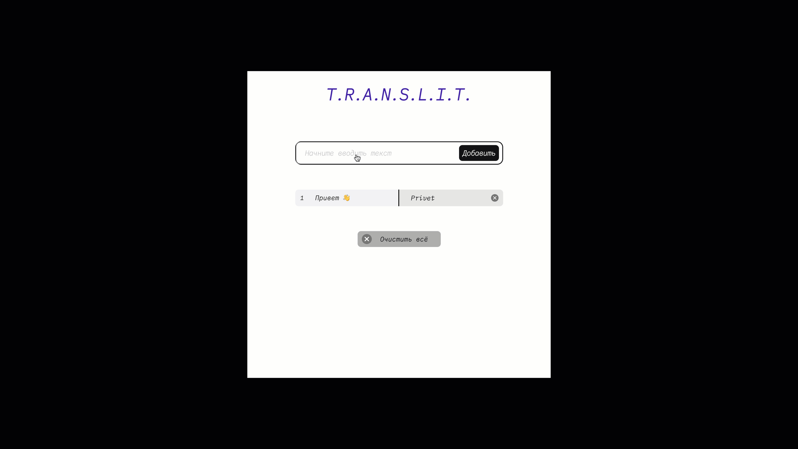

# Проект: T.R.A.N.S.L.I.T.

 Веб-приложение по [макету](https://www.figma.com/file/AWCUP5T3n3UnujErifjl2e/ECB-Phase-0-tasks-T.R.A.N.S.L.I.T.-share?node-id=0%3A1), которое будет превращать текст на русском языке в его транслитерацию и сохранять её в словарик.

### ТЕХНИЧЕСКОЕ ЗАДАНИЕ (ТЗ).

1) Верстка сделана по макету. Только первое и последнее слово имеют border-radius. Необязательно верстать pixel-perfect, но шрифты, маржины, паддинги, ширина, высота блоков и т.д. должны быть как на макете.
2) Верстка сделана для Desktop, Tablet и Mobile. Для мобильной верстки выберите 1 вариант из 2
3) Слова добавляются по клику на ENTER и кнопке ДОБАВИТЬ.
4) При первом запуске вашего приложения или при полном сбросе у вас только первая строчка ПРИВЕТ как на гифке выше. Эту строчку нельзя удалять и функционал удаления не должен работать для этой строчки.
5) Номера строчек должны обновляться при добавлении или удалении слов.
6) По клику на Х в правом блоке должна удаляться вся строка.
7) Если слово длинное, то должны добавить 3 точки. Если есть 3 точки, то при ховере должна быть подсказка без 3 точек. Подсказку нужно сделать 100% по макету
8) Если нет 3 точек, то блок с подсказкой не нужен.
9) По клику на СБРОСИТЬ ВСЁ нужно очистить всё что добавили, кроме 1 строчки.
10) Из всего макета можно использовать только иконку удаления строчки. Остальное всё нужно сверстать самим.

# 
